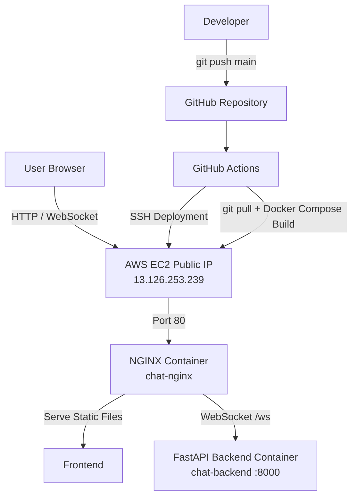

# Architecture Diagram

## Deployment Flow

1. User accesses the application through the AWS EC2 public IP.
2. NGINX receives traffic on port 80.
3. NGINX serves the frontend static files.
4. WebSocket `/ws` requests are proxied to the FastAPI backend container.
5. NGINX and backend communicate through the Docker Compose network.
6. A push to the `main` branch triggers GitHub Actions.
7. GitHub Actions connects to EC2 using SSH and automatically rebuilds and restarts the Docker containers.